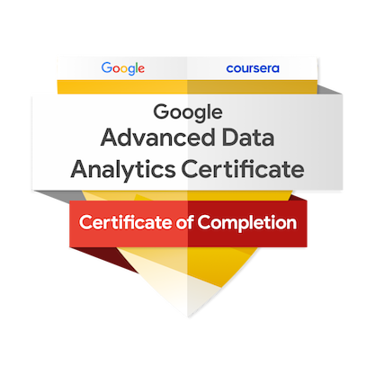
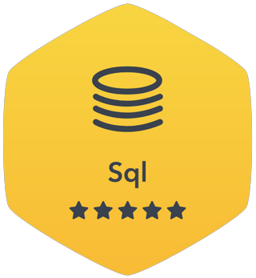

# 👋 Hi I'm Rutuja Chauhan!

I bring extensive expertise as a Data Engineer and Analyst, specializing in converting data into actionable insights. I possess proficiency in Python, Databricks, Vertex AI, as well as Azure and Google Cloud Services. My skills encompass data cleaning, modeling, and the creation of insightful dashboards tailored for data-driven decision-making. I have a robust foundation in statistics and machine learning, complemented by strong analytical and problem-solving capabilities.

***

<h3 style="text-align:center;"> 📝 Skills

    💻 Programming: Python, SQL

    ☁️ Cloud Platforms: Azure & Google Cloud Services.

    🔍 Visualization: Power BI, Looker Studio, Appache SuperSet

    📈 Analysis: Statistics, Machine Learning

    🤖 Generative AI: Vertex AI (Google gemini-vision pro, PALM2 etc., Autogen and agents)
*** 
# Professional Experience:

    Data Engineering:
    
    
    
    Utilized a diverse set of tools and skills within Microsoft Azure Stack (Python, SQL, Azure Data Factory, Azure Blob Storage, Azure Datalake, Databricks) and Google Cloud Stack (Storage Bucket, Cloud Dataflow, Cloud Functions, BigQuery) to orchestrate seamless data flows, connecting operational systems. Ensured accessibility for analytics and business intelligence applications by transforming raw data into actionable insights through adept utilization of Google Cloud and Microsoft Azure technologies.
    
    
    
    Championed the delivery of the strategic data vision, fostering networks to share insights and best practices. Demonstrated advanced skills in data quality, cleansing, and validation, ensuring the unassailable integrity of the data. Contributed to the development of robust data engineering frameworks, advocating best practices to enhance the availability, security, and performance of data assets.
    
    
    
    Built Data Engineering pipelines using Azure Data Factory and/or Azure Synapse and Azure Databricks. Collaborated effectively with cross-functional teams, including IT and business units, to ensure alignment and success of data-related initiatives.
    
    
    
    Data Analysis:
    
    
    
    Applied Python, SQL, Power BI, Looker Studio, and BigQuery in conducting comprehensive data analysis. Extracted insights from complex data sets to generate actionable recommendations. Executed Statistical Analysis and Exploratory Data Analysis to gain insights and identify patterns, trends, and outliers.
    
    Created and maintained dashboards and reports using Power BI and Google Data Studio, providing stakeholders with easy-to-understand insights into key business metrics. Effectively presented data insights, technical documentation, and recommendations to key stakeholders, including executives and department heads, using Microsoft PowerPoint and Word.
    
    
    
    Generative AI:
    
    
    
    Applied Python, Tesseract, EasyOcr, Vertex AI Models, and Huggingface Models in implementing generative AI techniques. Assessed candidates' potential by generating ratings and concise summaries for each resume, comparing them with job descriptions. Contributed to a project focused on utilizing images of diverse receipt types, extracting transaction data in JSON format for subsequent analysis.
    
    
    
    Worked on autogen agents with OpenAI and Google Gemini, showcasing proficiency in leveraging generative AI for innovative solutions.

***

<h3 style="text-align:center;"> 📜 Certificates

    
    
    
    

*** 

<h3 style="text-align:center;"> 🏅 Badges

    
    

*** 

<h3 style="text-align:center;">  🤝 Connect with me

    
    
    

